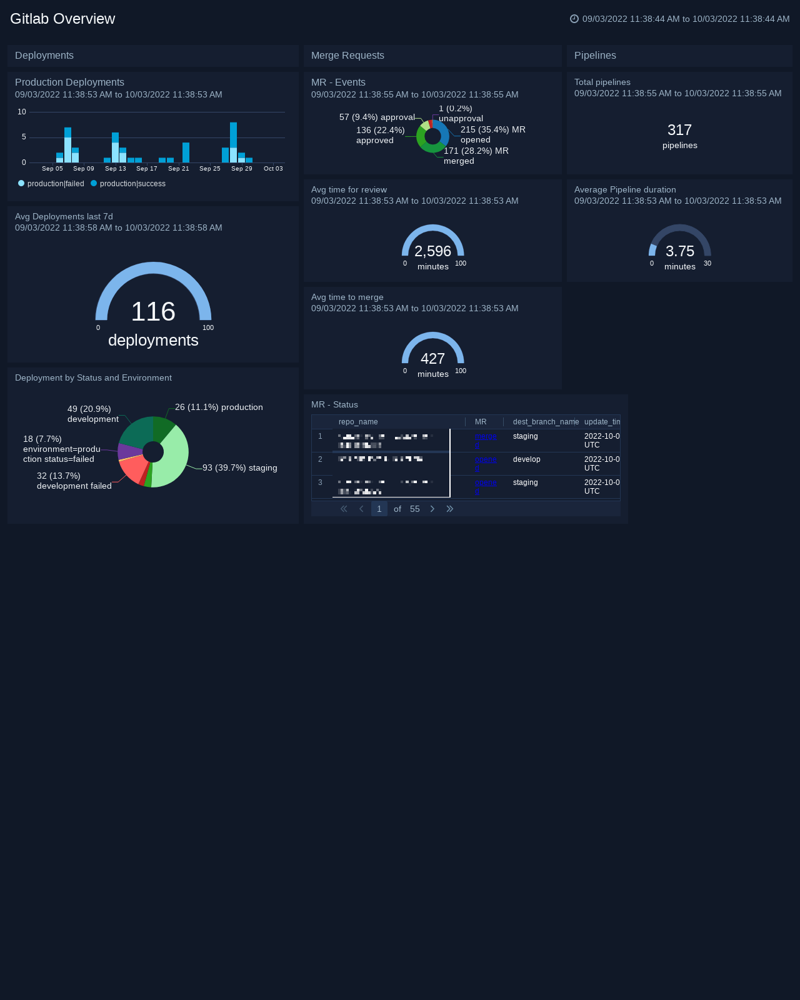
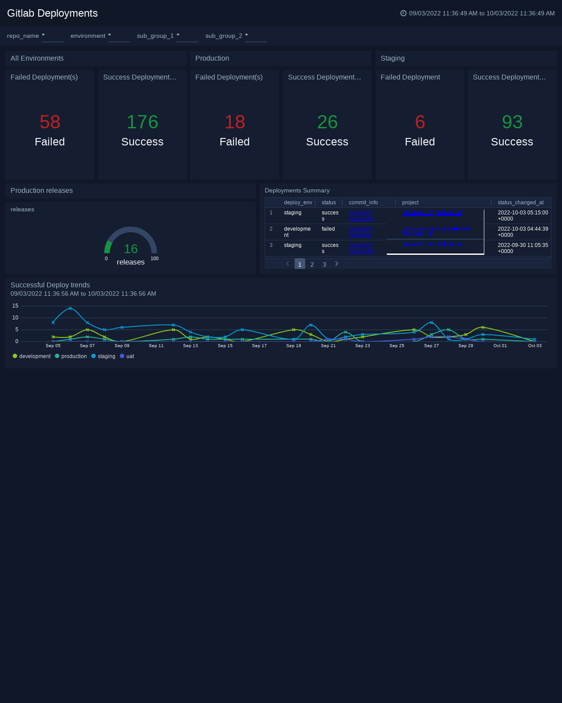
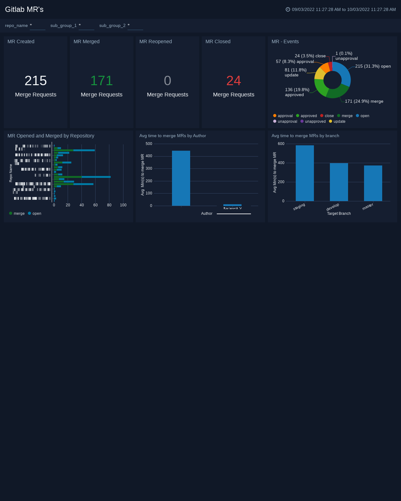

# Sumo Logic Monitoring

* Sumo Logic is a cloud data analytics platform that focuses on Security, Operations, and Business Intelligence use cases.
* I've had the opportunity to explore Sumo Logic for a wide variety of usecases ranging from Security, App Monitoring and Event management.

## Example Dashboards
* Be it Github, Gitlab or any Git tools. It is always good to monitor the changes from single place.
* The below dashboards were built for the purpose of measuring some interesting pipeline metrics as well auditing user's activites.

### Gitlab Overview
- The MR's dashboard helps us to understand, how frequent we're creating MR's and total numbers of MR's across branches under a single hood.

- It also identifies the average time for a MR to get merged with respect to branches.

### Gitlab Deployments
- The Deployments dashboard helps us to understand, how frequent we're creating MR's and total numbers of Deployments across environments under a single hood.

- It also identifies the average time for a MR to get merged with respect to branches.

### Gitlab MR's
- The MR's dashboard helps us to understand, how frequent we're creating MR's and total numbers of MR's across branches under a single hood.

- It also identifies the average time for a MR to get merged with respect to branches.
